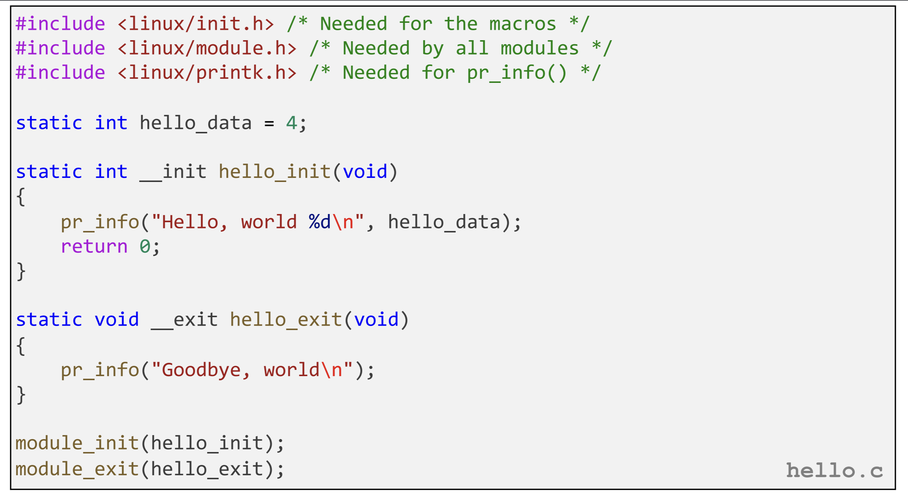

# Kernel Module Programming

On linux, there is an important distinction between **user mode** and **kernel mode** applications. Standard C programs are user mode applications. They are able to be compiled, run, and executed without any special privileges. User applications also take advantage of various pre-existing libraries and system resources such as calls to malloc(), process scheduling, etc. Underneath user applications sits the kernel, which is the component of the operating systems that manages critical resources. 

The kernel consists of core built-in code and optional loadable kernel modules that bridge between raw hardware components and software applications. Kernel modules run in kernel mode and share the kernel's address space. They lack user-space protections like process isolation, the standard C library, and Unix signals, and instead rely on kernel APIs and data structures directly. Though, kernel modules can directly communicate with hardware functionalities. As such, the type of applications written as kernel modules tend to be hardware drivers, low level operating system functionalities, malware detection, etc.

Writing kernel modules is significantly more error prone than user applications. This is due to the lack of safe guards preventing memory vulnerabilities. For example, because the kernel has direct access to hardware, you can easily overwrite important files of the operating system. If not careful, you can easily brick your device, or at least make it very challenging to return to a functional state. Additionally, without user-space signals, kernel modules that enter infinite loops have no safe, user-level way of being interrupted (no Ctrl-C in kernel applications), and can effectively hang the entire system. With these hazards in mind, it is important to reserve the kernel for applications that strictly require its functionality. As well as developing in a VM.

Unlike typical user space C code, kernel modules have no main function. Kernel modules compile to **.ko** object files. Kernel modules are not executed, rather they are loaded into and unloaded from the kernel. Once loaded into the kernel, the module initializes, then serves as an asynchronous functionality of the operating system from then on. As well, the kernel does not need to be recompiled every time a module is loaded or unloaded. Kernel modules are compiled individually, and their .ko object file is loaded/unloaded directly into the pre-existing kernel.

To see the available kernel modules on a linux machine, you can run **lsmod**. Inserting a new kernel module requires sudo privileges, and is done by **sudo insmod kernel_mod.ko**. Removing the module is done by **sudo rmmod kernel_mod**.

Although kernel modules cannot use standard C library file I/O like user applications, the kernel and user software are able to communicate in select ways. For example, when debugging, there is no *printf* function that can log results to the terminal. Rather, the kernel can write logs to the **ring buffer**, which is a byte buffer that can be written to by the kernel and read by user applications. When a kernel module writes to the ring buffer, user applications can view the logs with **dmesg**, which will print the output to terminal. 

In the above kernel module, the functions marked with **__init** and **__exit** use special kernel attributes indicating the module's constructor and destructor. When the *.ko* object file is inserted into the kernel, the *__init* function executes. Afterwards, the kernel acts asynconously. When the kernel is removed, the *__exit* function executes. Calls to **pr_info** write messages to the ring buffer.

To interact with the kernel from user space, the **/proc** file system is used. Files in **/proc** are virtual and do not store any data themselves. Instead, every read or write operation triggers callback functions defined by the kernel module, which dynamically generate or consume the data at access time. Kernel modules may choose to store received data in their own memory, but /proc itself does not hold buffers. For example, say a kernel module creates **/proc/procfile** on insertion into the kernel. Calling **echo "data" > /proc/procfile** will write "data" into the virtual procfile in the proc directory. To read data out of */proc/procfile*, you can then call **cat /proc/procfile**.

It should be noted that what exactly a kernel module does when data is written to or read from files in /proc files depends on the module. Kernel modules define asynchonous handler functions for these interactions. The above struct defines the asynchronous handlers for reads and writes to some /proc file.

 To transfer data to/from the userspace to kernel, the module must call **copy_to_user()** or **copy_from_user()** to fasciliate the transaction. The reason for this intermediary between kernel memory and user memory is to prevent use space from directly accessing privleged memory regiouns of the device.

Once data is in the kernels memory, there are certain functionalities provided by the kernel that can make programming modules easier. For example, linked lists, spin locks, timers, etc...