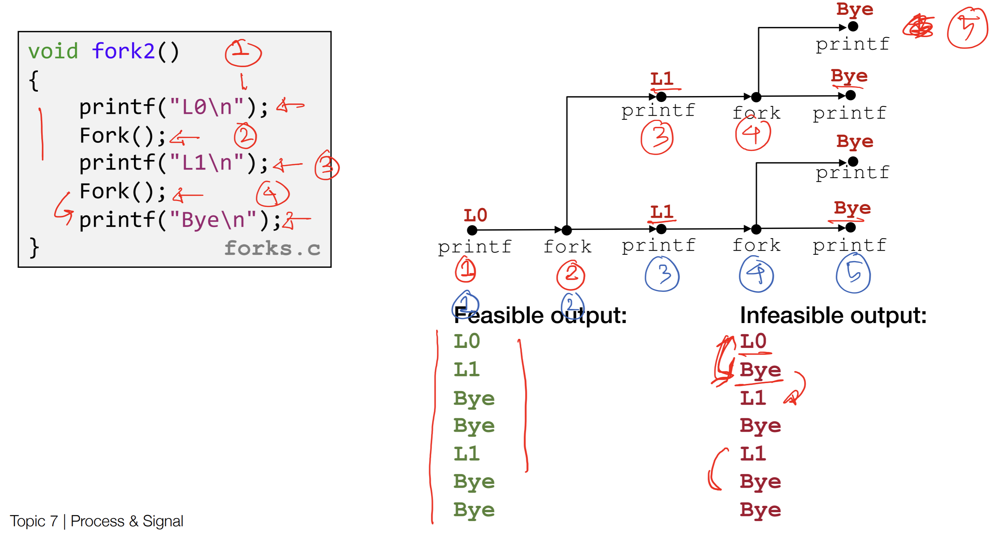
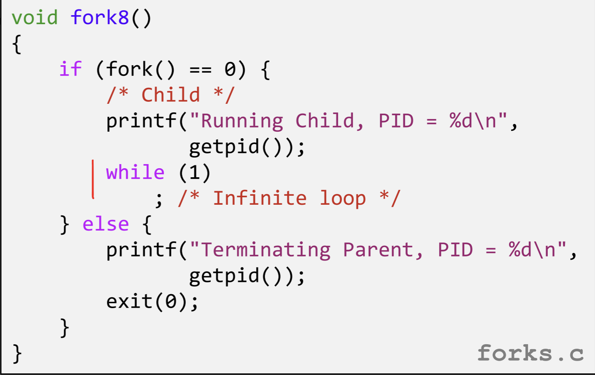
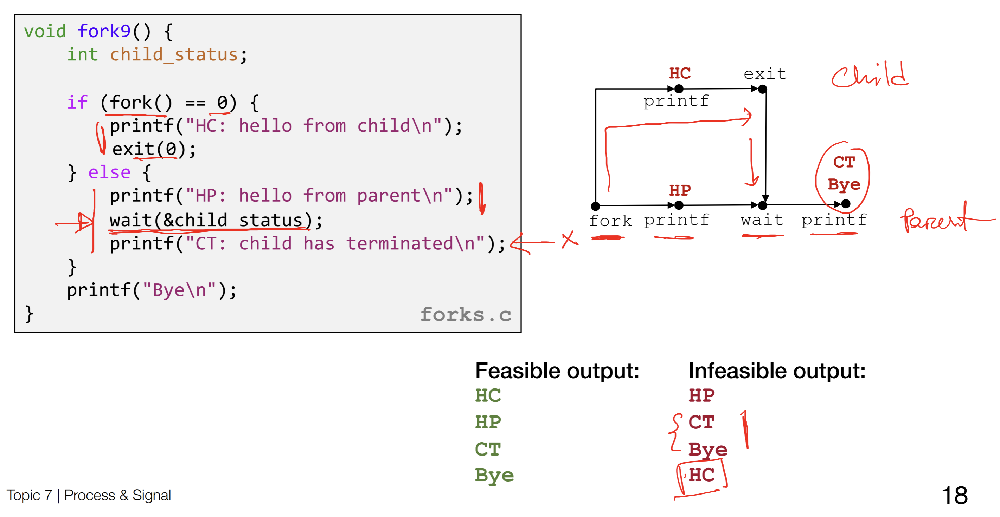

# Processes and Signals

### Processes

On linux, a process is a program with its own execution context. A process has its own stack, heap, address space, etc.

A child process is created by calling **fork()** from within a parent process. Calling fork() will copy the memory image of the calling process into a new process. Execution will continue as normal from then on. Only, there will now be two versions of the same process executing concurrently. The details of what concurrent execution means in this context depends on how the operating system scheduler handles multiple processes. As such, the exact execution order of forked processes is non deterministic.

When fork is called, the program execution bifurcates into a **process graph**. While the exact order of execution in such a graph is non deterministic, there are certain predictable behaviors. 

For example, in the above function *fork2()*, the parent process is forked twice in succession. Before the final print statement "Bye" can be reached, two child processes must be spawned, so we know that at the very least, before "Bye" can be printed, we must see "L0" and "L1" in the terminal output. 

Calling **exit()** will terminate a process with the exit code passed in as an argument. 

When forking processes, sometimes the parent process may exit before the child process. This is called an **orphan process**.
In the above function *fork8*, the parent process terminates, but the child process will continue to run.

There are also **zombie processes**, which refers to when a parent process does not properly handle the exit codes of a child process after it terminates. A parent process must **reap** child processes after they exit else they will continue to occupy a process ID.

The function *fork9* above prevents a zombie process by calling **wait()**, which retrieves the child’s exit status and removes the child’s entry from the kernel’s process table. This frees the PID so it can be reused.

As well, **execve()** can be used to load and run a process from a file. 

### Signals

Signals are messages accessible to processes about system-level events. They are asynchronous notifications sent to a process to inform it of events. Signals are sent from the kernel to a target process at the request of other processes.

For example, when a user interrupts a process from the terminal with **ctrl-c**, it sends the **SIGINT** signal to the process running in the terminal. The only information sent is the ID of **SIGINT**, which is 2. Specific signals have default actions associated with them, in this case, it is to terminate the process.

Signals provide a mechanism for separate processes to communicate with each other, using the kernel as an intermediary.

In the above example, the **kill()** function is used to send the SIGINT signal to the specified process from the calling process. Note that despite its name, kill() does not actually kill the given process, it sends a signal to a process. This is a strange quirk of the linux naming conventions.

Signals have default actions taken when receiving particular signals. However, it is also possible to overwrite signal handlers for application specific uses. For example, in the *fork12()* function above, the *sigint_handler* is installed to handle the *SIGINT* signal on arrival. Then, *pause()* waits for the next signal before continuing execution.

Also note that signal handlers can interrupt other signal handlers.
