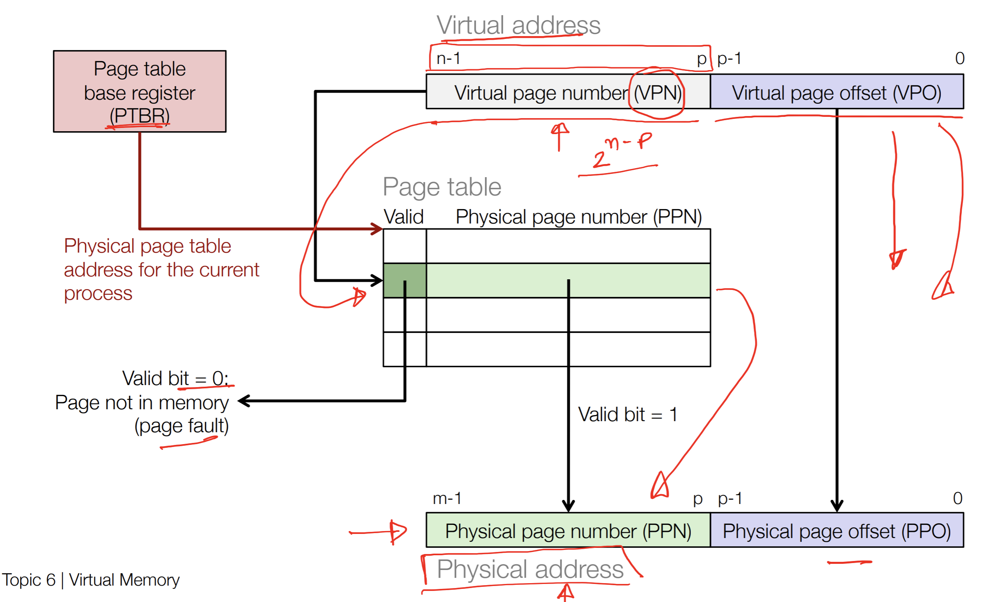

# Virtual Memory

### What is Virtual Memory

Physical memory is limited on real hardware. If a program needs more memory than is available on the device, it takes advantage of **virtual memory**. Virtual memory enables programmers to write code without thinking about the exact physical memory layout of their program.

When a process is created, the stack and heap are defined virtually. That is, the relationship between addresses in the stack and heap are internally consistent, but do not refer to actual phsyical addresses on the device. When the program executes, these virtual addresses are mapped to physical addresses by the memory management unit (MMU). This is a coordinated process between the operating system and hardware.

### Motivation and Drawbacks

The virtual memory abstraction enables the programmer to write code with arbitrary memory usage. The physical device is of course still memory limited, but behind the scenes the operating system will store data too large to fit into DRAM to disk and load it back into DRAM when needed. Making frequent trips to and from disk will hurt performance, but enables a broader class of programs to be written than would be possible otherwise. 

### How VM Works

Facilitating this process involves a kernel data structure called the **Page Table**.

Consider the following parameters

Let $N$ be the number of virtual addresses, $M$ be the number of physical addresses, $P$ be the page size.
$$
N = 2^n
$$

$$
M = 2^m
$$

$$
P = 2^p
$$

Programs that access virtual memory do so via **virtual addresses**. The bits of a virtual address are split into a **virtual page number (VPN)** and a **virtual page offset (VPO)**.

The overall virtual address takes up $n$ bits. Whereby the VPN occupies the most significant $n-p$ bits. The VPO occupies the least significant $p$ bits.

The VPN is used to index the page table data structure. Each entry of the page table is comprised of a **valid bit**, as well as a **physical page number (PPN)**. The PPN refers to the most significant $m-p$ bits of a physical address. The least significant $p$ bits of the physical address are the same as the $p$ VPO bits. This section of the physical address is called the **physical page offset (PPO)**.

The mechanism that enables the virtual address space to be orders of magnitude larger than what is available in DRAM is that the page tables provides a way to *page in and out to disk*, while themselves living in RAM . That is, the amount of bytes the page table can refer to may be many times larger than the physical address space because each page table entry refers to a $p$ size chunk of bytes, allowing for an efficient indexing via this address mapping. The PPN specifies a **physical page frame**, ie a collection of contiguous bytes indexed by the VPO/PPO.

In this way, a page table can be thought of as a cache, whereby if the valid bit is set to $1$, it indicates that at the associated physical address mapping, there is data already loaded into memory ready to be accessed. If the valid bit is 0, the page is not currently in physical memory. A page fault occurs, and the operating system loads the page from disk into a physical frame before resuming execution. It is called a page hit when the data is already in memory.

Also note that this virtual memory caching operates one level of abstraction away from L1-L3 caches. That is, when the CPU is attempting to access some data, it will first check if it is present in registers, then L1-L3 cache, then DRAM. However, as DRAM is virtual from the perspective of the program, it will check if the valid bit is set for the virtual address in question, and if not will fetch from disk. It is loads from disk via this caching mechanism that incur the most significant performance degradation.
